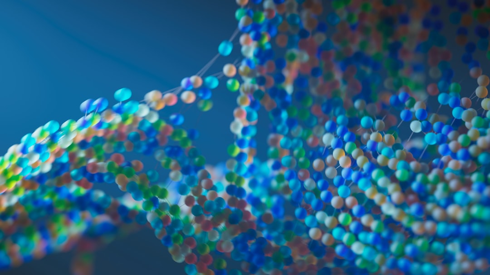
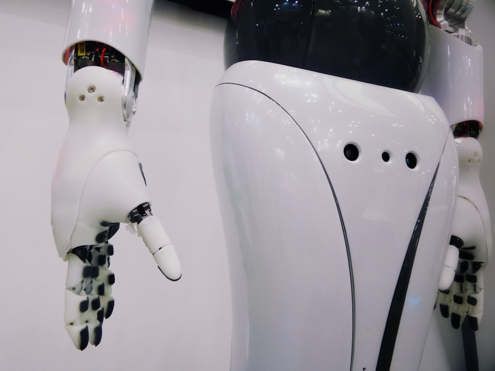
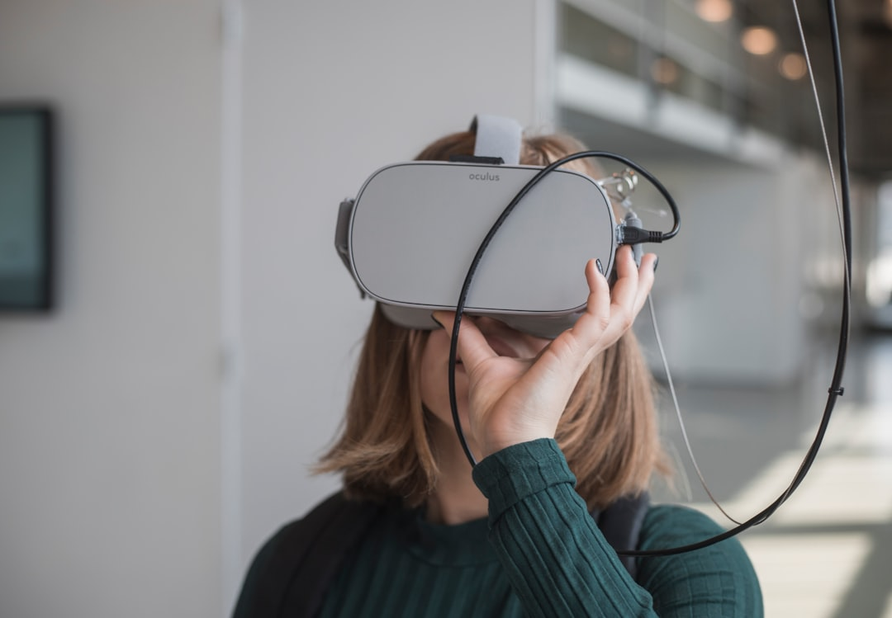

# 人工智能塑造未来：技术变革中的人类适应与社会演化

每当夜深人静，我常常会想起《2001太空漫游》中那个著名的场景：黑色巨石出现在人类祖先面前，瞬间开启了智慧的火种。今天，我们似乎正站在另一块"黑色巨石"面前——人工智能。不同的是，这次我们既是观察者，也是创造者，更是这场变革的亲历者。

*AI技术正在以神经网络的方式重塑我们的世界*

2025年已经到来，回望过去几年AI的发展轨迹，我深深感受到一种前所未有的加速度。从ChatGPT的惊艳亮相到各种大模型的百花齐放，从简单的文本生成到复杂的多模态交互，AI正在以一种近乎颠覆性的方式重新定义我们的世界。

## 技术奇点临近：AI发展的指数级加速

### 从工具到伙伴的演变

还记得几年前，我们对AI的期待还停留在"智能助手"的层面。那时候，Siri能听懂我们的指令就已经让人惊叹，而现在，我们已经在与AI进行深度对话，让它帮助我们思考、创作、甚至做决策。

这种变化不仅仅是技术的进步，更是一种本质上的跃迁。AI正在从被动的工具转向主动的伙伴。我最近在使用AI协助写作时，常常会有一种奇妙的感觉——不是我在"使用"AI，而是我们在"协作"。这种微妙的心理变化，实际上反映了技术发展的深层趋势。

数据显示，仅在过去一年中，商业领袖对生成式AI的使用率就从55%激增至75%。这不仅仅是使用率的提升，更重要的是使用方式的转变。人们开始从简单的"试用"转向真正的"依赖"和"融合"。

### 技术能力的质变

如果说过去的AI更像是一个"博学的学生"，那么现在的AI更像是一个"睿智的导师"。以OpenAI的o1模型为例，它展现出的不仅仅是知识的广度，更是思维的深度。我曾经让它帮我分析一个复杂的商业问题，它的分析过程竟然和我的思考路径如此相似，甚至在某些方面比我考虑得更周全。

这种能力的提升不是线性的，而是跳跃式的。就像人类从猿到人的进化过程中，某一刻突然学会了使用工具，AI似乎也在经历类似的"顿悟"时刻。

更让人惊讶的是成本效率的提升。在不到两年的时间里，实现同等效果的AI模型成本降低了数十倍。这意味着什么？这意味着AI将不再是大公司的专利，而是可以普及到每个人、每个小企业的工具。这种民主化的趋势，将会带来更深远的社会影响。

### 科学研究的新纪元

AI在科学研究中的应用让我特别兴奋。作为一个对科学充满好奇的人，我经常关注AI在药物研发、气候研究、材料科学等领域的突破。最近看到AI帮助科学家预测蛋白质结构，加速新药研发的消息，我深深感受到这不仅仅是技术的胜利，更是人类智慧的延伸。

想象一下，如果AI能够帮助我们在几个月内完成原本需要几年甚至几十年的研究工作，那么人类对宇宙奥秘的探索速度将会如何提升？这种可能性让我既兴奋又有些不安。

## 社会经济的深度重构：从工业社会到智能社会

### 就业结构的根本性变化

前段时间，我和一位在制造业工作了20多年的朋友聊天。他告诉我，他们工厂的生产线上，原本需要50个工人的岗位，现在只需要5个技术员来监控智能设备。这个变化让我深刻理解了什么叫"就业结构的根本性变化"。

正如前IMF副总裁朱民所说的那样，"未来就业结构会变化，所有简单重复性的劳动岗位都会被取代。"这不是危言耸听，而是正在发生的现实。但这种变化并不意味着失业率的整体提升，而是工作内容的彻底转变。

我观察到一个有趣的现象：AI行业的求职者增长率达到33.4%，位居所有行业首位。AI工程师的平均月薪达到21,319元，领跑所有职业。这种对比鲜明地展示了劳动力市场的两极分化趋势。

### 人才需求的新变化

这种变化让我想起了历史上的几次工业革命。每一次技术革命都会淘汰一些职业，同时创造更多新的职业。但这次不同的是，变化的速度前所未有。

我最近接触了一些正在转型的企业，发现他们最缺的不是传统意义上的"技术工人"，而是既懂技术又懂业务，既能与AI协作又能发挥人类独特优势的"复合型人才"。这种人才的稀缺性，正在重新定义整个就业市场的价值体系。

### 数据驱动的新经济模式

2025年被称为"AI agents的元年"，这个概念让我特别关注。AI agents不再是简单的自动化工具，而是能够自主学习、自主决策的智能体。这种转变将会催生全新的商业模式。

想象一下，未来的公司可能不再需要传统意义上的"员工"，而是由人类管理者和AI agents组成的混合团队。这种模式下，企业的组织结构、管理方式、甚至价值创造的逻辑都会发生根本性的改变。

## 人类的适应与进化：如何在AI时代保持relevance

### 教育体系的深层变革

作为一个终身学习者，我深刻感受到教育在AI时代面临的挑战。传统的教育模式主要是"填鸭式"的知识传授，但当AI可以瞬间获取和处理海量信息时，这种模式的价值在哪里？

我最近参观了一所试点AI教育的学校，看到学生们不再是被动地接受知识，而是在AI的辅助下主动探索、思考和创造。这种变化让我想起了苏格拉底的"产婆术"——教育的本质不是给予答案，而是启发思考。

但我也有担忧。有教育学者警告说，过度依赖AI可能会"剥夺"人们个人和集体成长的动力。这种担忧并非没有道理。如果我们习惯了AI的便利，会不会逐渐失去独立思考的能力？

### 技能发展的新方向

在这个问题上，我的观察是：AI无法替代的恰恰是最"人性化"的能力。创意思维、情感智能、道德判断、复杂问题的整体性思考——这些都是人类独有的优势。

我最近在阅读一本关于认知科学的书，里面提到人类智能的三个层次：程序性认知技能（容易被AI替代）、非程序性认知技能（部分可以被AI替代）、非程序性非认知技能（难以被AI替代）。这个分类让我重新思考了人类能力的价值。

### 人机协作的新模式

我个人最感兴趣的是人机协作的新模式。在我的工作中，我已经开始尝试与AI建立一种"合作伙伴"关系。我负责创意构思和整体把控，AI负责信息收集和细节完善。这种协作不仅提高了效率，更重要的是释放了我去做更有创造性工作的时间。

*未来的工作模式：人类与AI的深度协作*

这种协作模式让我想起了音乐家与乐器的关系。钢琴家不会因为钢琴能发出美妙的声音就失去价值，相反，正是钢琴的存在让音乐家能够创造出更美妙的音乐。AI也许就是我们这个时代的"钢琴"。

### 心理适应的挑战

但我必须承认，适应AI时代并不容易。有时候，当我看到AI轻松完成我曾经引以为豪的工作时，会有一种微妙的挫败感。这种感觉让我想到了国际象棋大师卡斯帕罗夫被深蓝击败时的心情。

这种心理适应的过程，我觉得是每个人都必须经历的。关键是要调整心态，把AI看作是能力的延伸而不是威胁。就像望远镜让我们看得更远，显微镜让我们看得更细，AI让我们思考得更深。

## 未来的挑战与机遇

### 技术发展的不确定性

站在2025年这个时间点，我对AI的未来发展既充满期待又保持警惕。技术发展的速度如此之快，以至于我们很难准确预测五年后的世界会是什么样子。

这种不确定性既是挑战也是机遇。对于个人来说，这意味着我们需要保持持续学习的能力，适应不断变化的环境。对于社会来说，这意味着我们需要建立更加灵活的制度和机制。

### 社会公平的新思考

AI发展带来的另一个深层次问题是社会公平。当AI技术主要掌握在少数大公司手中时，会不会加剧社会不平等？当AI能力成为核心竞争力时，那些无法获得AI工具的人群会不会被进一步边缘化？

这些问题没有简单的答案，但我认为这正是我们需要深入思考的方向。技术本身是中性的，关键是如何使用技术。

### 人类价值的重新定义

最后，我想谈谈人类价值的重新定义。在AI时代，什么才是人类独有的价值？我的答案是：创造力、同理心、道德判断，以及最重要的——爱与被爱的能力。

这些能力不仅仅是我们与AI的区别，更是我们作为人类的本质。无论技术如何发展，这些品质都将是我们最宝贵的财富。

## 结语：拥抱变化，主动适应

写到这里，我想起了查尔斯·达尔文的名言："能够存活下来的不是最强的，也不是最聪明的，而是最能适应变化的。"这句话在AI时代显得格外有意义。

*教育变革：培养适应AI时代的新一代人才*

我们正站在一个历史的拐点上。AI的发展不可逆转，但我们可以选择如何应对这种变化。我们可以选择恐惧和抵触，也可以选择拥抱和适应。

对我个人来说，这种选择很明确：我要成为AI时代的积极参与者，而不是被动的观察者。我要学会与AI协作，同时保持人类独有的品质。我要拥抱变化，同时守护那些永恒的价值。

最后，我想说：AI时代的到来不是人类的终结，而是人类的新开始。就像我们的祖先学会使用工具一样，我们正在学会使用AI。这个过程充满挑战，但也充满希望。

让我们一起走进这个充满可能性的新时代，用智慧和勇气书写属于我们这一代人的历史。

---

*这篇文章写于2025年7月9日，记录了我对AI时代的观察和思考。技术在变化，但人类的智慧和情感永恒。*